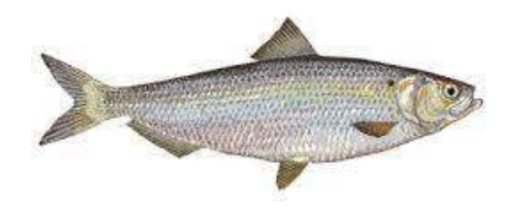
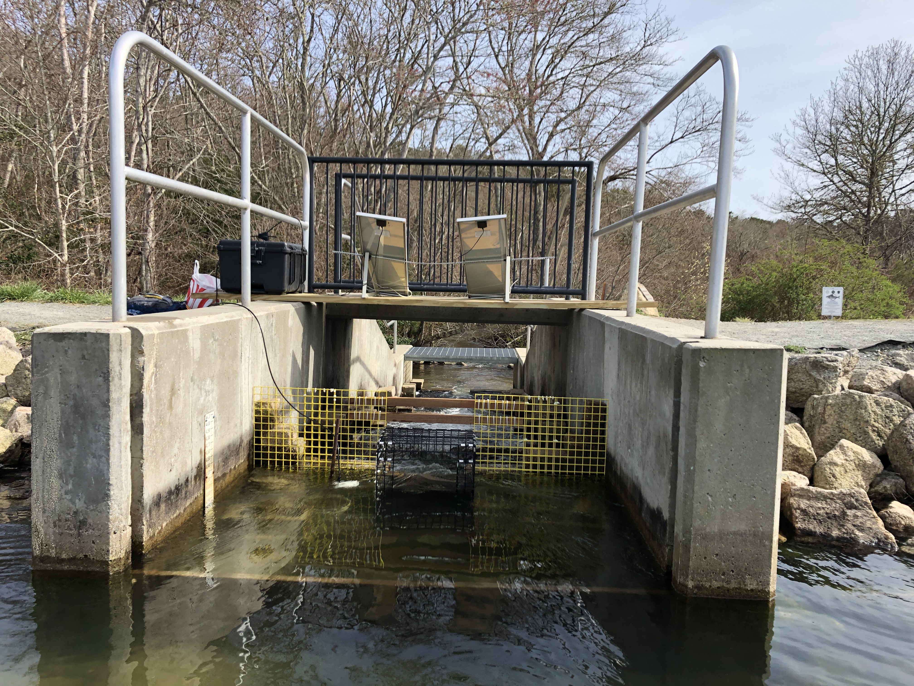
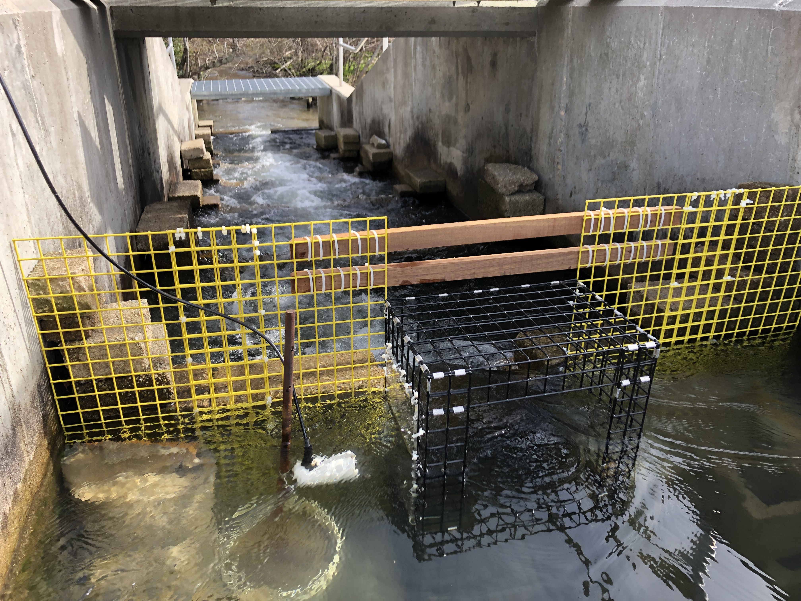
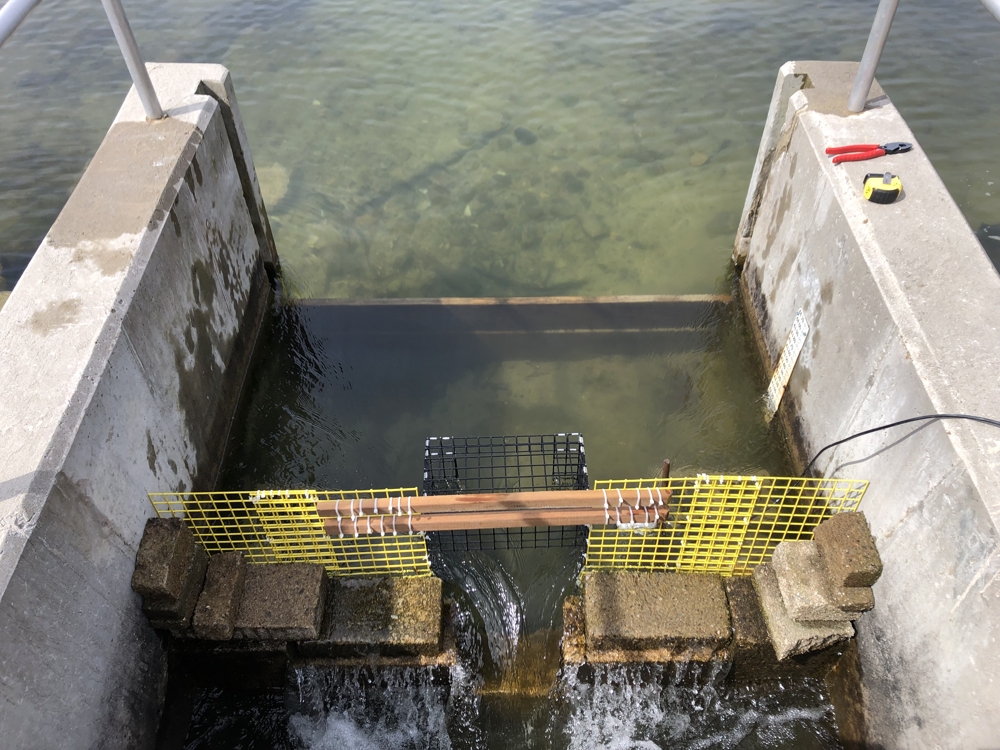
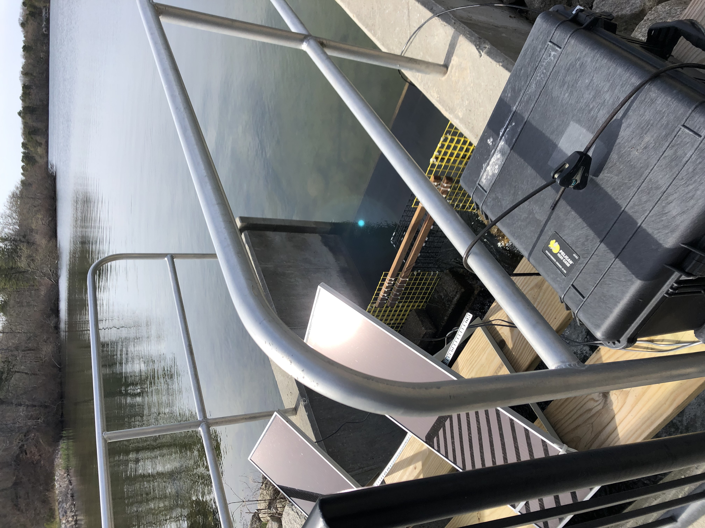
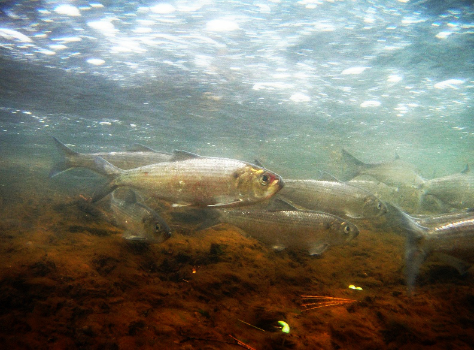
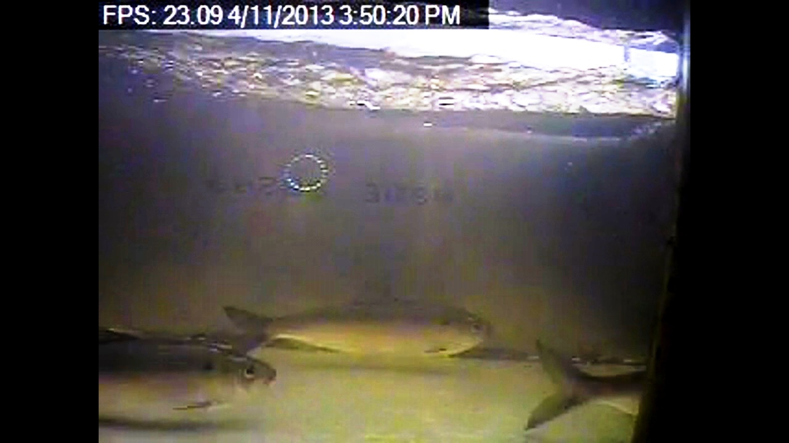
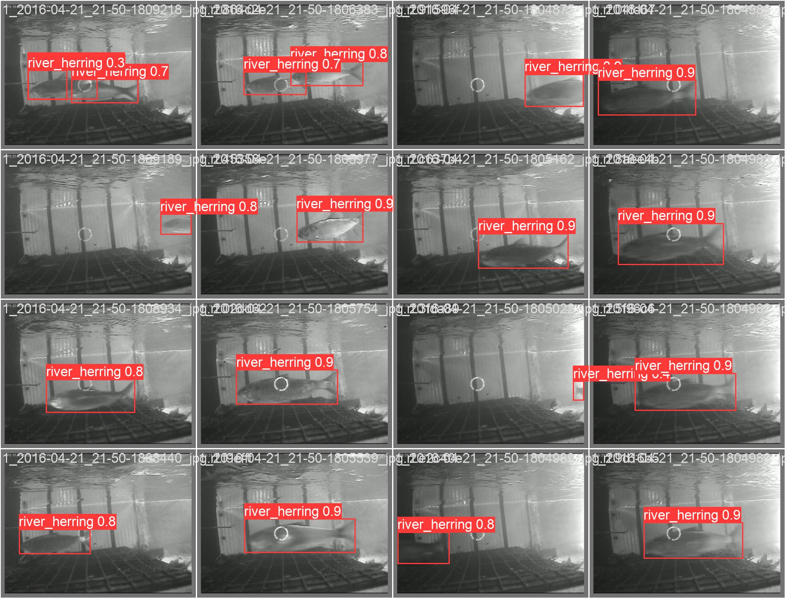
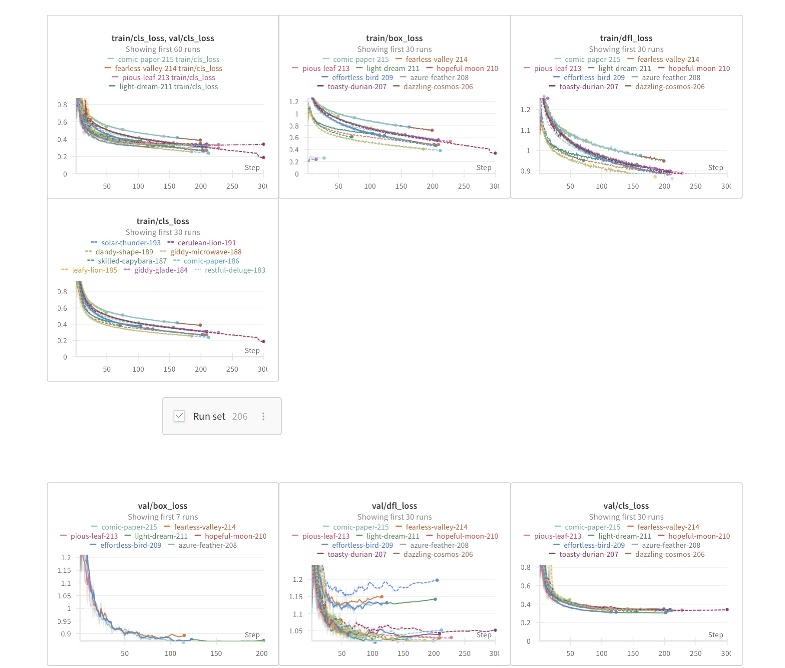

# MIT Fishery Counter


### Contributors
* *Robert Vincent (Research Advisor)*
* *Austin Powell (Contributor)*
* *Lydia Zuehsow (Contributor)*
* *Blaine Gilbreth (Contributor)*

## Overview
Fisheries populations have a large impact on the U.S. economy. Each year the U.S. fishing industry contributes 90 billion dollars and 1.5 million jobs to the U.S. economy. Each species may serve as a predator or prey for another. In this regard, fisheries populations are interconnected and dependent. While humans may depend on these populations as a source of sustenance (food, goods, etc.), humans can also negatively impact population growth. Barriers to migration, pollution, overfishing, and other forms of human-interference may impact spawning patterns of fisheries species. In 2014, 17% of U.S. fisheries were classified as overfished. Therefore, it is necessary to monitor these fisheries populations to determine when policy must be changed in efforts to maintain healthy oceans.

Many groups, including NOAA Fisheries, state agencies, as well as regional fisheries councils and local municipalities, deploy camera and video equipment to monitor fisheries populations. Large amounts of video and photographic data are gathered at timed intervals. However, not all photos contain aquatic life. Currently, employees at these agencies among others are responsible for manually annotating the gathered videos and photos; this means they identify and count the relevant aquatic specimens in the data. Not only is this an inefficient use of time and resources, but also it can lead to inaccurate results due to human error. NOAA Fisheries Management can make a significant improvement in time and resource use through automation of the annotation process.

## Objectives:
1. Identify fish as River Herring and Not River Herring (or by individual species)
2. Count River Herring Only
3. Count fish passing by in only one direction
4. Date and time stamps
5. Provide summary statistics output tables and figures
6. Provide an estimate of identification and count accuracy
7. Develop software that can be given to fisheries managers so that they can run the software on their own video and have the computer count and total fish for their spawning run season
8. Develop real-time monitoring and counting in the field with weekly downloads
9. Develop a user interface for non-computer programmers
10. Include other monitoring sensor and output such as temperature, current speed, light, and measurements of fish length and biomass would be desirable as well.

## Setup
Current setup is a gated entry into the resorvoir in order to allow cameras to capture all of the content in cages.
### Cameras and Gates
<p float="left">
  
   
   
   
</p> 

#### Camera

* [64mp-ultra-high-res-camera-raspberry](https://www.arducam.com/64mp-ultra-high-res-camera-raspberry-pi/)
* [950-Analog-Drop-Camera_p_20](https://seaviewer-com.3dcartstores.com/950-Analog-Drop-Camera_p_20.html)

#### 
[Meshtastic](https://meshtastic.org/docs/hardware/devices/)

### Locations
Currently 4 locations stationed in Massachusetts
```geojson
{ "type": "Feature", "properties": { "GEO_ID": "0400000US25", "STATE": "25", "NAME": "Massachusetts", "LSAD": "", "CENSUSAREA": 7800.058000 }, "geometry": { "type": "MultiPolygon", "coordinates": [ [ [ [ -70.832044, 41.606504 ], [ -70.823735, 41.598569 ], [ -70.820918, 41.587673 ], [ -70.821910, 41.582841 ], [ -70.830087, 41.585385 ], [ -70.838452, 41.596460 ], [ -70.832044, 41.606504 ] ] ], [ [ [ -70.596280, 41.471905 ], [ -70.574850, 41.468259 ], [ -70.567356, 41.471208 ], [ -70.563280, 41.469127 ], [ -70.553277, 41.452955 ], [ -70.552943, 41.443394 ], [ -70.555588, 41.430882 ], [ -70.553096, 41.423952 ], [ -70.547567, 41.415831 ], [ -70.538301, 41.409241 ], [ -70.528581, 41.405100 ], [ -70.517584, 41.403769 ], [ -70.506984, 41.400242 ], [ -70.502372, 41.392005 ], [ -70.501306, 41.385391 ], [ -70.498959, 41.384339 ], [ -70.490758, 41.383634 ], [ -70.484503, 41.386290 ], [ -70.472604, 41.399128 ], [ -70.473035, 41.408757 ], [ -70.470788, 41.412875 ], [ -70.463833, 41.419145 ], [ -70.450431, 41.420703 ], [ -70.446233, 41.396480 ], [ -70.449268, 41.380422 ], [ -70.448262, 41.353651 ], [ -70.451084, 41.348161 ], [ -70.496162, 41.346452 ], [ -70.538294, 41.348958 ], [ -70.599157, 41.349272 ], [ -70.709826, 41.341723 ], [ -70.733253, 41.336226 ], [ -70.747541, 41.329952 ], [ -70.764188, 41.318706 ], [ -70.768015, 41.311959 ], [ -70.766166, 41.308962 ], [ -70.768687, 41.303702 ], [ -70.775665, 41.300982 ], [ -70.802083, 41.314207 ], [ -70.819415, 41.327212 ], [ -70.838777, 41.347209 ], [ -70.833802, 41.353386 ], [ -70.812309, 41.355745 ], [ -70.800289, 41.353800 ], [ -70.783291, 41.347829 ], [ -70.774974, 41.349176 ], [ -70.768901, 41.353246 ], [ -70.729225, 41.397728 ], [ -70.724366, 41.398942 ], [ -70.712432, 41.408850 ], [ -70.711493, 41.415460 ], [ -70.701378, 41.430925 ], [ -70.686881, 41.441334 ], [ -70.649330, 41.461068 ], [ -70.603555, 41.482384 ], [ -70.598444, 41.481151 ], [ -70.596280, 41.471905 ] ] ], [ [ [ -70.092142, 41.297741 ], [ -70.082072, 41.299093 ], [ -70.062565, 41.308726 ], [ -70.046088, 41.321651 ], [ -70.031332, 41.339332 ], [ -70.028805, 41.359919 ], [ -70.030924, 41.367453 ], [ -70.035162, 41.372161 ], [ -70.038458, 41.376399 ], [ -70.045586, 41.383598 ], [ -70.049564, 41.387900 ], [ -70.049053, 41.391702 ], [ -70.033514, 41.385816 ], [ -70.018446, 41.368630 ], [ -69.960277, 41.278731 ], [ -69.960181, 41.264546 ], [ -69.964422, 41.254570 ], [ -69.965725, 41.252466 ], [ -69.975000, 41.247392 ], [ -70.001586, 41.239353 ], [ -70.015225, 41.237964 ], [ -70.052807, 41.242685 ], [ -70.083239, 41.244400 ], [ -70.096967, 41.240850 ], [ -70.118669, 41.242351 ], [ -70.170681, 41.255881 ], [ -70.237175, 41.282724 ], [ -70.256164, 41.288123 ], [ -70.266776, 41.294453 ], [ -70.273478, 41.301528 ], [ -70.275526, 41.310464 ], [ -70.260632, 41.310092 ], [ -70.249276, 41.305623 ], [ -70.244435, 41.303203 ], [ -70.240153, 41.295384 ], [ -70.229541, 41.290171 ], [ -70.208690, 41.290171 ], [ -70.196304, 41.294612 ], [ -70.124460, 41.293851 ], [ -70.092142, 41.297741 ] ] ], [ [ [ -73.264957, 42.745940 ], [ -73.022903, 42.741133 ], [ -72.809113, 42.736581 ], [ -72.458519, 42.726853 ], [ -72.285954, 42.721631 ], [ -72.124526, 42.717636 ], [ -71.981402, 42.713294 ], [ -71.928811, 42.712234 ], [ -71.745817, 42.707287 ], [ -71.636214, 42.704888 ], [ -71.631814, 42.704788 ], [ -71.351874, 42.698154 ], [ -71.330206, 42.697190 ], [ -71.294205, 42.696990 ], [ -71.278929, 42.711258 ], [ -71.267905, 42.725890 ], [ -71.255605, 42.736389 ], [ -71.245504, 42.742589 ], [ -71.233404, 42.745489 ], [ -71.223904, 42.746689 ], [ -71.208302, 42.743314 ], [ -71.208227, 42.743294 ], [ -71.208137, 42.743273 ], [ -71.181803, 42.737590 ], [ -71.186104, 42.790689 ], [ -71.174403, 42.801589 ], [ -71.167703, 42.807389 ], [ -71.165603, 42.808689 ], [ -71.149703, 42.815489 ], [ -71.132503, 42.821389 ], [ -71.064201, 42.806289 ], [ -71.053601, 42.833089 ], [ -71.047501, 42.844089 ], [ -71.044401, 42.848789 ], [ -71.031201, 42.859089 ], [ -70.966500, 42.868989 ], [ -70.949199, 42.876089 ], [ -70.931699, 42.884189 ], [ -70.930799, 42.884589 ], [ -70.927629, 42.885326 ], [ -70.914899, 42.886589 ], [ -70.914886, 42.886564 ], [ -70.902768, 42.886530 ], [ -70.886136, 42.882610 ], [ -70.848625, 42.860939 ], [ -70.837376, 42.864996 ], [ -70.830795, 42.868918 ], [ -70.821769, 42.871880 ], [ -70.817296, 42.872290 ], [ -70.817731, 42.850613 ], [ -70.805220, 42.781798 ], [ -70.792867, 42.747118 ], [ -70.772267, 42.711064 ], [ -70.770453, 42.704824 ], [ -70.778552, 42.698520 ], [ -70.778671, 42.693622 ], [ -70.764421, 42.685650 ], [ -70.748752, 42.683878 ], [ -70.744427, 42.682092 ], [ -70.729820, 42.669602 ], [ -70.728845, 42.663877 ], [ -70.689402, 42.653319 ], [ -70.682594, 42.654525 ], [ -70.681594, 42.662342 ], [ -70.663548, 42.677603 ], [ -70.645101, 42.689423 ], [ -70.630077, 42.692699 ], [ -70.620031, 42.688006 ], [ -70.622864, 42.675990 ], [ -70.623815, 42.665481 ], [ -70.622791, 42.660873 ], [ -70.614820, 42.657650 ], [ -70.595474, 42.660336 ], [ -70.591742, 42.648508 ], [ -70.591469, 42.639821 ], [ -70.594014, 42.635030 ], [ -70.605611, 42.634898 ], [ -70.618420, 42.628640 ], [ -70.635635, 42.600243 ], [ -70.654727, 42.582234 ], [ -70.664887, 42.580436 ], [ -70.668022, 42.581732 ], [ -70.668115, 42.585361 ], [ -70.668488, 42.589643 ], [ -70.670442, 42.592249 ], [ -70.672583, 42.594296 ], [ -70.675747, 42.594669 ], [ -70.678819, 42.594389 ], [ -70.681428, 42.593173 ], [ -70.684502, 42.588858 ], [ -70.698574, 42.577393 ], [ -70.729688, 42.571510 ], [ -70.737044, 42.576863 ], [ -70.757283, 42.570455 ], [ -70.804091, 42.561595 ], [ -70.815391, 42.554195 ], [ -70.823291, 42.551495 ], [ -70.848492, 42.550195 ], [ -70.871382, 42.546404 ], [ -70.872357, 42.542952 ], [ -70.866279, 42.522617 ], [ -70.859751, 42.520441 ], [ -70.857125, 42.521492 ], [ -70.842091, 42.519495 ], [ -70.831091, 42.503596 ], [ -70.835991, 42.490496 ], [ -70.841591, 42.487596 ], [ -70.847391, 42.491496 ], [ -70.857791, 42.490296 ], [ -70.879692, 42.478796 ], [ -70.886493, 42.470197 ], [ -70.887992, 42.467096 ], [ -70.887292, 42.464896 ], [ -70.894292, 42.460896 ], [ -70.908092, 42.466896 ], [ -70.917693, 42.467996 ], [ -70.921993, 42.466696 ], [ -70.934993, 42.457896 ], [ -70.934264, 42.444646 ], [ -70.933155, 42.437833 ], [ -70.928226, 42.430986 ], [ -70.913192, 42.427697 ], [ -70.908392, 42.425197 ], [ -70.901992, 42.420297 ], [ -70.905692, 42.416197 ], [ -70.936393, 42.418097 ], [ -70.943295, 42.436248 ], [ -70.943612, 42.452092 ], [ -70.947020, 42.456236 ], [ -70.960470, 42.446166 ], [ -70.960835, 42.441272 ], [ -70.982994, 42.423996 ], [ -70.987694, 42.416696 ], [ -70.990595, 42.407098 ], [ -70.989195, 42.402598 ], [ -70.985068, 42.402041 ], [ -70.983426, 42.396246 ], [ -70.980336, 42.391513 ], [ -70.972706, 42.389968 ], [ -70.970195, 42.388036 ], [ -70.971740, 42.387071 ], [ -70.972513, 42.385042 ], [ -70.972706, 42.381759 ], [ -70.972223, 42.377316 ], [ -70.953292, 42.349698 ], [ -70.953022, 42.343973 ], [ -70.963578, 42.346860 ], [ -70.974897, 42.355843 ], [ -70.979927, 42.356382 ], [ -70.998253, 42.352788 ], [ -71.006877, 42.347039 ], [ -71.015680, 42.326019 ], [ -71.013165, 42.315419 ], [ -71.000948, 42.302483 ], [ -71.006158, 42.288110 ], [ -71.004900, 42.282720 ], [ -70.996097, 42.271222 ], [ -70.989090, 42.267449 ], [ -70.967351, 42.268168 ], [ -70.956219, 42.270794 ], [ -70.956239, 42.278728 ], [ -70.953833, 42.280791 ], [ -70.948971, 42.272505 ], [ -70.945547, 42.269081 ], [ -70.935886, 42.264189 ], [ -70.924830, 42.263339 ], [ -70.926336, 42.269792 ], [ -70.917056, 42.272542 ], [ -70.912932, 42.269792 ], [ -70.906301, 42.271637 ], [ -70.896267, 42.285100 ], [ -70.895778, 42.292436 ], [ -70.897123, 42.295860 ], [ -70.915588, 42.302463 ], [ -70.917490, 42.305686 ], [ -70.907556, 42.307889 ], [ -70.882764, 42.308860 ], [ -70.881242, 42.300663 ], [ -70.870873, 42.285668 ], [ -70.861807, 42.275965 ], [ -70.851093, 42.268270 ], [ -70.831075, 42.267424 ], [ -70.811742, 42.262935 ], [ -70.788724, 42.253920 ], [ -70.770964, 42.249197 ], [ -70.764757, 42.244062 ], [ -70.754488, 42.228673 ], [ -70.747230, 42.221816 ], [ -70.730560, 42.210940 ], [ -70.722269, 42.207959 ], [ -70.718707, 42.184853 ], [ -70.714301, 42.168783 ], [ -70.706264, 42.163137 ], [ -70.685315, 42.133025 ], [ -70.663931, 42.108336 ], [ -70.640169, 42.088633 ], [ -70.638480, 42.081579 ], [ -70.647349, 42.076331 ], [ -70.648190, 42.068441 ], [ -70.643208, 42.050821 ], [ -70.597892, 42.004550 ], [ -70.602704, 42.002144 ], [ -70.614046, 42.006612 ], [ -70.631919, 41.992864 ], [ -70.639137, 41.993895 ], [ -70.641199, 42.005925 ], [ -70.636387, 42.013830 ], [ -70.629857, 42.001456 ], [ -70.610953, 42.011080 ], [ -70.644337, 42.045895 ], [ -70.650874, 42.046247 ], [ -70.669360, 42.037116 ], [ -70.671666, 42.021390 ], [ -70.667512, 42.012320 ], [ -70.670934, 42.007786 ], [ -70.678798, 42.005510 ], [ -70.686798, 42.012764 ], [ -70.695809, 42.013346 ], [ -70.712204, 42.007586 ], [ -70.710034, 41.999544 ], [ -70.698981, 41.987103 ], [ -70.662476, 41.960592 ], [ -70.651673, 41.958701 ], [ -70.648365, 41.961672 ], [ -70.631251, 41.950475 ], [ -70.623513, 41.943273 ], [ -70.616491, 41.940204 ], [ -70.608166, 41.940701 ], [ -70.598078, 41.947772 ], [ -70.583572, 41.950007 ], [ -70.552941, 41.929641 ], [ -70.546386, 41.916751 ], [ -70.547410, 41.911934 ], [ -70.545949, 41.907158 ], [ -70.532084, 41.889568 ], [ -70.525567, 41.858730 ], [ -70.535487, 41.839381 ], [ -70.542065, 41.831263 ], [ -70.543168, 41.824446 ], [ -70.541030, 41.815754 ], [ -70.532656, 41.804796 ], [ -70.517411, 41.790953 ], [ -70.494048, 41.773883 ], [ -70.471552, 41.761563 ], [ -70.412476, 41.744397 ], [ -70.375341, 41.738779 ], [ -70.290957, 41.734312 ], [ -70.275203, 41.726143 ], [ -70.272289, 41.721346 ], [ -70.263654, 41.714115 ], [ -70.259205, 41.713954 ], [ -70.234850, 41.733733 ], [ -70.216073, 41.742981 ], [ -70.189254, 41.751982 ], [ -70.182076, 41.750885 ], [ -70.141533, 41.760072 ], [ -70.121978, 41.758841 ], [ -70.096061, 41.766549 ], [ -70.064314, 41.772845 ], [ -70.024734, 41.787364 ], [ -70.008462, 41.800786 ], [ -70.003842, 41.808520 ], [ -70.004486, 41.838826 ], [ -70.009013, 41.876625 ], [ -70.000188, 41.886938 ], [ -70.002922, 41.890315 ], [ -70.012154, 41.891656 ], [ -70.024335, 41.898820 ], [ -70.025553, 41.911699 ], [ -70.030537, 41.929154 ], [ -70.044995, 41.930049 ], [ -70.054464, 41.927366 ], [ -70.065671, 41.911658 ], [ -70.065723, 41.899641 ], [ -70.065372, 41.887702 ], [ -70.064084, 41.878924 ], [ -70.066002, 41.877011 ], [ -70.067566, 41.877793 ], [ -70.070889, 41.882973 ], [ -70.073039, 41.899783 ], [ -70.074006, 41.938650 ], [ -70.077421, 41.985497 ], [ -70.083775, 42.012041 ], [ -70.089578, 42.024896 ], [ -70.095595, 42.032832 ], [ -70.108060, 42.043601 ], [ -70.123043, 42.051668 ], [ -70.148294, 42.061950 ], [ -70.155415, 42.062409 ], [ -70.169781, 42.059736 ], [ -70.178468, 42.056420 ], [ -70.186816, 42.050450 ], [ -70.194456, 42.039470 ], [ -70.195345, 42.034163 ], [ -70.193074, 42.027576 ], [ -70.189461, 42.024236 ], [ -70.173758, 42.027357 ], [ -70.166884, 42.034575 ], [ -70.171008, 42.028045 ], [ -70.179601, 42.021858 ], [ -70.186708, 42.019904 ], [ -70.190834, 42.020028 ], [ -70.196693, 42.022429 ], [ -70.208016, 42.030730 ], [ -70.218701, 42.045848 ], [ -70.233256, 42.057714 ], [ -70.238875, 42.060479 ], [ -70.243540, 42.060569 ], [ -70.245385, 42.063733 ], [ -70.238087, 42.072878 ], [ -70.225626, 42.078601 ], [ -70.206899, 42.081900 ], [ -70.189305, 42.082337 ], [ -70.160166, 42.078628 ], [ -70.115968, 42.067638 ], [ -70.082624, 42.054657 ], [ -70.058531, 42.040363 ], [ -70.033501, 42.017736 ], [ -70.011898, 41.989720 ], [ -69.986085, 41.949597 ], [ -69.968598, 41.911700 ], [ -69.945314, 41.845222 ], [ -69.935952, 41.809422 ], [ -69.928652, 41.741250 ], [ -69.928261, 41.691700 ], [ -69.933114, 41.670014 ], [ -69.947599, 41.645394 ], [ -69.951169, 41.640799 ], [ -69.957775, 41.620364 ], [ -69.976478, 41.603664 ], [ -69.982768, 41.581812 ], [ -69.988215, 41.554704 ], [ -69.998071, 41.543650 ], [ -70.004136, 41.542120 ], [ -70.011504, 41.542924 ], [ -70.014456, 41.545534 ], [ -70.016584, 41.550772 ], [ -70.015059, 41.553037 ], [ -70.010644, 41.552692 ], [ -70.001530, 41.561953 ], [ -69.994357, 41.576846 ], [ -69.987192, 41.608579 ], [ -69.973035, 41.641046 ], [ -69.973153, 41.646963 ], [ -69.975719, 41.653738 ], [ -69.996359, 41.667184 ], [ -70.007011, 41.671579 ], [ -70.014211, 41.671971 ], [ -70.029346, 41.667744 ], [ -70.055523, 41.664843 ], [ -70.089238, 41.662813 ], [ -70.140877, 41.650423 ], [ -70.158621, 41.650438 ], [ -70.191061, 41.645259 ], [ -70.245867, 41.628479 ], [ -70.256210, 41.620698 ], [ -70.255420, 41.617541 ], [ -70.259601, 41.610863 ], [ -70.265424, 41.609333 ], [ -70.267587, 41.610912 ], [ -70.269687, 41.617775 ], [ -70.269130, 41.625742 ], [ -70.274522, 41.632927 ], [ -70.281320, 41.635125 ], [ -70.290620, 41.635196 ], [ -70.321588, 41.630508 ], [ -70.329924, 41.634578 ], [ -70.338067, 41.636338 ], [ -70.351634, 41.634687 ], [ -70.360352, 41.631069 ], [ -70.364892, 41.626721 ], [ -70.364744, 41.623671 ], [ -70.369854, 41.615888 ], [ -70.379151, 41.611361 ], [ -70.400581, 41.606382 ], [ -70.408535, 41.607345 ], [ -70.437246, 41.605329 ], [ -70.445289, 41.591815 ], [ -70.461278, 41.571820 ], [ -70.476256, 41.558502 ], [ -70.485571, 41.554244 ], [ -70.493244, 41.552044 ], [ -70.522327, 41.548965 ], [ -70.559689, 41.548330 ], [ -70.611081, 41.542989 ], [ -70.633607, 41.538254 ], [ -70.643627, 41.532357 ], [ -70.654104, 41.519025 ], [ -70.663856, 41.514031 ], [ -70.675379, 41.512623 ], [ -70.705181, 41.496677 ], [ -70.734306, 41.486335 ], [ -70.757171, 41.469917 ], [ -70.756481, 41.465977 ], [ -70.760863, 41.460947 ], [ -70.790270, 41.446339 ], [ -70.817478, 41.445562 ], [ -70.835867, 41.441877 ], [ -70.857528, 41.425767 ], [ -70.866946, 41.422378 ], [ -70.902763, 41.421061 ], [ -70.928197, 41.415781 ], [ -70.937282, 41.411618 ], [ -70.948431, 41.409193 ], [ -70.951045, 41.411777 ], [ -70.949861, 41.415323 ], [ -70.928165, 41.431265 ], [ -70.923698, 41.430716 ], [ -70.918983, 41.425300 ], [ -70.911640, 41.424484 ], [ -70.906011, 41.425708 ], [ -70.883247, 41.432239 ], [ -70.855265, 41.448892 ], [ -70.828546, 41.456448 ], [ -70.802186, 41.460864 ], [ -70.787769, 41.474609 ], [ -70.775268, 41.477465 ], [ -70.753905, 41.492256 ], [ -70.745053, 41.500966 ], [ -70.658659, 41.543385 ], [ -70.654302, 41.549926 ], [ -70.655365, 41.557498 ], [ -70.653899, 41.565160 ], [ -70.648780, 41.569870 ], [ -70.642748, 41.572385 ], [ -70.640948, 41.577325 ], [ -70.642040, 41.583066 ], [ -70.652449, 41.605210 ], [ -70.651986, 41.610184 ], [ -70.640003, 41.624616 ], [ -70.645251, 41.633547 ], [ -70.652614, 41.637829 ], [ -70.650419, 41.644202 ], [ -70.638695, 41.649427 ], [ -70.637632, 41.654573 ], [ -70.639003, 41.658345 ], [ -70.651956, 41.663044 ], [ -70.653754, 41.667090 ], [ -70.644339, 41.673020 ], [ -70.646308, 41.678433 ], [ -70.649285, 41.680943 ], [ -70.661475, 41.681756 ], [ -70.645962, 41.693794 ], [ -70.625440, 41.698691 ], [ -70.623652, 41.707398 ], [ -70.626529, 41.712995 ], [ -70.644641, 41.718980 ], [ -70.651093, 41.715715 ], [ -70.656596, 41.715401 ], [ -70.670453, 41.721912 ], [ -70.708193, 41.730959 ], [ -70.718739, 41.735740 ], [ -70.726331, 41.732731 ], [ -70.728933, 41.723433 ], [ -70.721302, 41.712968 ], [ -70.717451, 41.693980 ], [ -70.719575, 41.685002 ], [ -70.729395, 41.688140 ], [ -70.744396, 41.696967 ], [ -70.755347, 41.694326 ], [ -70.761481, 41.676808 ], [ -70.762360, 41.667735 ], [ -70.758198, 41.661225 ], [ -70.757622, 41.654265 ], [ -70.765463, 41.641575 ], [ -70.769318, 41.641145 ], [ -70.773654, 41.645033 ], [ -70.775798, 41.649145 ], [ -70.776709, 41.650756 ], [ -70.809118, 41.656437 ], [ -70.813286, 41.655670 ], [ -70.815729, 41.652796 ], [ -70.816351, 41.645995 ], [ -70.804664, 41.641157 ], [ -70.800215, 41.631753 ], [ -70.801063, 41.629513 ], [ -70.810279, 41.624873 ], [ -70.835296, 41.624532 ], [ -70.844165, 41.628983 ], [ -70.852518, 41.626919 ], [ -70.855162, 41.624145 ], [ -70.850181, 41.593529 ], [ -70.853121, 41.587321 ], [ -70.857239, 41.587705 ], [ -70.868904, 41.614664 ], [ -70.868360, 41.622664 ], [ -70.869624, 41.625608 ], [ -70.872665, 41.627816 ], [ -70.889209, 41.632904 ], [ -70.913202, 41.619266 ], [ -70.904522, 41.610361 ], [ -70.899981, 41.593504 ], [ -70.901381, 41.592504 ], [ -70.910814, 41.595506 ], [ -70.916581, 41.607483 ], [ -70.920074, 41.610810 ], [ -70.927172, 41.611253 ], [ -70.929722, 41.609479 ], [ -70.930000, 41.600441 ], [ -70.927393, 41.594064 ], [ -70.931338, 41.584200 ], [ -70.937978, 41.577416 ], [ -70.941588, 41.581034 ], [ -70.946911, 41.581089 ], [ -70.948797, 41.579038 ], [ -70.947300, 41.573659 ], [ -70.937830, 41.565239 ], [ -70.931545, 41.540169 ], [ -70.941785, 41.540121 ], [ -70.953299, 41.515010 ], [ -70.982654, 41.510077 ], [ -71.003275, 41.511912 ], [ -71.019354, 41.508857 ], [ -71.035514, 41.499047 ], [ -71.058418, 41.505967 ], [ -71.085663, 41.509292 ], [ -71.120570, 41.497448 ], [ -71.122400, 41.522156 ], [ -71.131312, 41.592308 ], [ -71.131618, 41.593918 ], [ -71.137492, 41.602561 ], [ -71.140588, 41.605102 ], [ -71.140910, 41.607405 ], [ -71.141509, 41.616076 ], [ -71.140468, 41.623893 ], [ -71.135688, 41.628402 ], [ -71.134484, 41.641198 ], [ -71.134478, 41.641262 ], [ -71.132670, 41.658744 ], [ -71.132888, 41.660102 ], [ -71.134688, 41.660502 ], [ -71.135188, 41.660502 ], [ -71.145870, 41.662795 ], [ -71.153989, 41.664102 ], [ -71.176090, 41.668102 ], [ -71.176090, 41.668502 ], [ -71.175990, 41.671402 ], [ -71.181290, 41.672502 ], [ -71.191175, 41.674292 ], [ -71.191178, 41.674216 ], [ -71.194390, 41.674802 ], [ -71.195640, 41.675090 ], [ -71.195690, 41.675102 ], [ -71.208371, 41.690598 ], [ -71.224798, 41.710498 ], [ -71.225791, 41.711701 ], [ -71.261392, 41.752301 ], [ -71.317795, 41.776101 ], [ -71.327896, 41.780501 ], [ -71.329396, 41.782600 ], [ -71.329296, 41.786800 ], [ -71.332196, 41.792300 ], [ -71.333896, 41.794500 ], [ -71.335797, 41.794800 ], [ -71.339297, 41.796300 ], [ -71.340697, 41.798300 ], [ -71.340797, 41.800200 ], [ -71.339297, 41.804400 ], [ -71.339297, 41.806500 ], [ -71.338897, 41.808300 ], [ -71.339197, 41.809000 ], [ -71.347197, 41.823100 ], [ -71.344897, 41.828000 ], [ -71.339597, 41.832000 ], [ -71.337597, 41.833700 ], [ -71.335197, 41.835500 ], [ -71.341797, 41.843700 ], [ -71.342198, 41.844800 ], [ -71.333997, 41.862300 ], [ -71.340798, 41.881600 ], [ -71.339298, 41.893399 ], [ -71.339298, 41.893599 ], [ -71.338698, 41.898399 ], [ -71.352699, 41.896699 ], [ -71.354699, 41.896499 ], [ -71.362499, 41.895599 ], [ -71.364699, 41.895399 ], [ -71.365399, 41.895299 ], [ -71.370999, 41.894599 ], [ -71.373799, 41.894399 ], [ -71.376600, 41.893999 ], [ -71.381700, 41.893199 ], [ -71.381700, 41.922699 ], [ -71.381600, 41.922899 ], [ -71.381401, 41.964799 ], [ -71.381501, 41.966699 ], [ -71.381401, 42.018798 ], [ -71.499905, 42.017198 ], [ -71.500905, 42.017098 ], [ -71.527306, 42.015098 ], [ -71.527606, 42.014998 ], [ -71.559439, 42.014342 ], [ -71.576908, 42.014098 ], [ -71.766010, 42.009745 ], [ -71.799242, 42.008065 ], [ -71.800650, 42.023569 ], [ -71.890780, 42.024368 ], [ -71.987326, 42.026880 ], [ -72.063496, 42.027347 ], [ -72.135687, 42.030245 ], [ -72.249523, 42.031626 ], [ -72.317148, 42.031907 ], [ -72.456680, 42.033999 ], [ -72.528131, 42.034295 ], [ -72.573231, 42.030141 ], [ -72.582332, 42.024695 ], [ -72.590233, 42.024695 ], [ -72.606933, 42.024995 ], [ -72.607933, 42.030795 ], [ -72.643134, 42.032395 ], [ -72.695927, 42.036788 ], [ -72.755838, 42.036195 ], [ -72.757538, 42.033295 ], [ -72.753538, 42.032095 ], [ -72.751738, 42.030195 ], [ -72.754038, 42.025395 ], [ -72.757467, 42.020947 ], [ -72.758151, 42.020865 ], [ -72.760558, 42.021846 ], [ -72.762151, 42.021527 ], [ -72.762310, 42.019775 ], [ -72.761354, 42.018183 ], [ -72.759738, 42.016995 ], [ -72.761238, 42.014595 ], [ -72.763238, 42.012795 ], [ -72.763265, 42.009742 ], [ -72.766139, 42.007695 ], [ -72.766739, 42.002995 ], [ -72.816741, 41.997595 ], [ -72.813541, 42.036494 ], [ -72.847142, 42.036894 ], [ -72.863619, 42.037709 ], [ -72.863733, 42.037710 ], [ -72.999549, 42.038653 ], [ -73.053254, 42.039861 ], [ -73.229798, 42.044877 ], [ -73.231056, 42.044945 ], [ -73.293097, 42.046940 ], [ -73.294420, 42.046984 ], [ -73.432812, 42.050587 ], [ -73.487314, 42.049638 ], [ -73.496879, 42.049675 ], [ -73.508142, 42.086257 ], [ -73.352527, 42.510002 ], [ -73.264957, 42.745940 ] ] ], [ [ [ -70.890594, 42.326504 ], [ -70.898155, 42.330284 ], [ -70.898155, 42.340252 ], [ -70.895477, 42.343422 ], [ -70.894028, 42.339565 ], [ -70.873749, 42.343346 ], [ -70.878220, 42.330627 ], [ -70.890594, 42.326504 ] ] ], [ [ [ -70.925308, 42.317223 ], [ -70.928055, 42.317223 ], [ -70.942490, 42.326847 ], [ -70.930458, 42.334751 ], [ -70.923584, 42.326160 ], [ -70.925308, 42.317223 ] ] ], [ [ [ -70.955460, 42.309875 ], [ -70.977219, 42.310249 ], [ -70.977402, 42.312294 ], [ -70.967545, 42.322895 ], [ -70.957268, 42.331661 ], [ -70.952805, 42.330627 ], [ -70.949364, 42.312756 ], [ -70.955460, 42.309875 ] ] ], [ [ [ -70.937332, 42.284916 ], [ -70.949020, 42.285946 ], [ -70.951080, 42.289726 ], [ -70.935272, 42.302101 ], [ -70.928185, 42.302814 ], [ -70.927979, 42.297405 ], [ -70.937332, 42.284916 ] ] ], [ [ [ -70.290428, 41.331959 ], [ -70.305893, 41.332302 ], [ -70.309669, 41.335396 ], [ -70.308296, 41.338833 ], [ -70.289047, 41.336773 ], [ -70.290428, 41.331959 ] ] ], [ [ [ -70.811417, 41.249870 ], [ -70.825508, 41.252277 ], [ -70.832039, 41.259495 ], [ -70.812454, 41.263962 ], [ -70.802139, 41.258121 ], [ -70.803856, 41.250557 ], [ -70.811417, 41.249870 ] ] ] ] } }
```

### Herring Example Photos
<p float="left">
   
     
</p>

## Methods
* Phase 1 - Detection: During the detection phase we are running our computationally more expensive object tracker to (1) detect if new objects have entered our view, and (2) see if we can find objects that were "lost" during the tracking phase. For each detected object we create or update an object tracker with the new bounding box coordinates. Since our object detector is more computationally expensive we only run this phase once every N frames.
* Phase 2 - Tracking: When we are not in the "detecting" phase we are in the "tracking" phase. For each of our detected objects, we create an object tracker to track the object as it moves around the frame. Our object tracker should be faster and more efficient than the object detector. We’ll continue tracking until we’ve reached the N-th frame and then re-run our object detector. The entire process then repeats.

The benefit of this hybrid approach is that we can apply highly accurate object detection methods without as much of the computational burden. 

### References
* **https://pyimagesearch.com/2018/08/13/opencv-people-counter/**
* https://help.ubidots.com/en/articles/1674356-people-counting-systems-with-opencv-python-and-ubidots

#### Documentation
* [Instruction Manual](/documentation/Instruction%20Manual.pdf)

#### Dropbox
Currently linking to Dropbox folders for large files
* [Original Project Files](https://www.dropbox.com/sh/26y1pqukooepsmr/AADXGlkRWTFrKl9GwN1SpDRUa?dl=0)
* [2017 Software](https://www.dropbox.com/sh/26y1pqukooepsmr/AAD5wAO3EgLeyT7ENfvqhgIIa/2017%20Software?dl=0&subfolder_nav_tracking=1)

##### Whitepapers
* Read more [AMS Presentation](/documentation/AMS%20Presentation.pdf)

##### Future-Work:
* Implement automation of fish counting from images that removes manual process of running on individual's machines
* Continue applying image recognition to herring:
	* Of interest to NOAA Fisheries, state agencies, as well as regional fisheries councils and local municipalities.
	* Image recognition is a novel approach
* Develop graphical user interface for end-users
* Test other image recognition algorithms, such as Faster R-CNN and Mask R-CNN

#### Other
* *Useful apps and software:*
  * *Labeling:*
    * Roboflow ()
  * *Useful Tools and Apps:*
    * *Testing Threshold:* https://kxborg-open-threshold-threshold-a2jyh4.streamlit.app

## Model Maintenance and inference:

### Setup:
* Python3.8 required

* Example annotations:
<p float="left">
   
</p>
* Example video snippet (click to view):

[](https://youtu.be/qszev6AgkgA "Example Annotated Video")

* **Current Methods**
  * NOTES:
    * Training:
      * Yolov Medium model improvement of ~30% in speed and 10% performance over original Yolo v5 
     * 
     * [Training Notes](https://docs.google.com/document/d/1yLzUTvkOgHK4bfKO-WSn6hYkMr5eNbepW6A-Kdlq7jY/edit)
  * [ML System Design Planning](https://docs.google.com/document/d/1pmF5qaTwF8WI8LtYAa3pcG4to8LAxShJv5j3_R5d8Gk/edit)

* **Original Setup**
  * **Labeling**
    * https://github.com/heartexlabs/labelImg (Used for project)
    * https://www.scalabel.ai
  * **Training:**
    * Tutorials on training YOLO
        * [THIS GUIDE](https://learnopencv.com/training-yolov3-deep-learning-based-custom-object-detector/)
        * [yolov7-training-on-custom-data](https://medium.com/augmented-startups/yolov7-training-on-custom-data-b86d23e6623)
    2. **Quick Start for this code:**
        1. Navigate to darknet folder
        2. Run: *./darknet detector test ../weights/weights_and_config_files/Herring/herring.data ../weights/weights_and_config_files/Herring/herring.cfg ../weights/weights_and_config_files/Herring/herring_final.weights
  *   Training:

[Alt Text](./pics/training_history.jpg)




### Pipeline Version Changes

1. **Model Enhancement (Version 1):**
   - Improved inference speed by 40% by updating base code from original research project.
   - Implemented Roboflow for data format transformation and augmentation.

2. **Insights and Optimization (Version 2):**
   - Identified challenges with cls_loss and optimized model parameters.
   - Leveraged Roboflow's workflow features for efficient dataset maintenance.

3. **Labeling Strategies (Version 3):**
   - Introduced labeling insights, including the importance of "null" images and maximizing target class in tracking.
   - Applied noise to images for confidence regularization.

4. **Augmentation Strategies (Version 4):**
   - Adjusted augmenting the box around the class for improved tracking results on golden dataset.
   - Experimented with dropout variations and limited image augmentations for improved tracking results from 22% counting to 15% counting error (MAPE). 